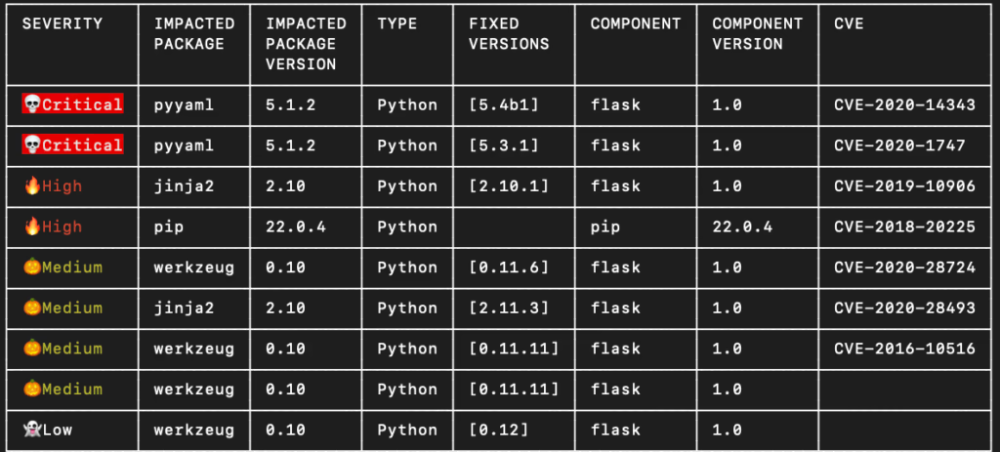

[](#readme)

<div align="center">

# GitLab Templates for JFrog

</div>

- [Overview](#Overview)
- [Installation](#Installation) 
  - [Storing the JFrog Platform Connection Details](#Storing-the-JFrog-Platform-Connection-Details)
  - [Adding the setup-jfrog Script in Your Pipeline](#Adding-the-setup-jfrog-Script-in-Your-Pipeline)
  - [Additional Optional Variables](#Additional-Optional-Variables)
  - [Prerequisites](#Prerequisites)
  - [Limitations](#Limitations)
  - [Behind The Scenes](#Behind-The-Scenes)
- [Templates](#Templates)
  - [Build and Upload to JFrog Artifactory](#build-and-upload-to-jfrog-artifactory)
  - [Security Audit with JFrog Xray](#security-audit-with-jfrog-xray)
- [Set Up a FREE JFrog Environment in the Cloud](#Set-Up-a-FREE-JFrog-Environment-in-the-Cloud)

# Overview
This repository includes pipeline templates for GitLab CI, for a quick and easy integration with the [JFrog Platform](https://jfrog.com/platform/).

The templates use the [.setup-jfrog.yml](https://github.com/jfrog/jfrog-cli/blob/v2/build/gitlab/.setup-jfrog.yml) pipeline script. The script is included by each of the templates, and sets up the integration between the pipeline and the JFrog Platform.

The script does the following:
* Installs [JFrog CLI](https://www.jfrog.com/confluence/display/CLI/JFrog+CLI)
* Configures JFrog CLI to work with the JFrog Platform
* Sets the build name and build number values with the values of `$CI_PROJECT_PATH_SLUG-$CI_COMMIT_REF_NAME` and `$CI_PIPELINE_ID` respectively, to allow publishing [build-info](https://www.buildinfo.org/) to Artifactory 
* Optionally replaces the default Docker Registry with an [Artifactory Docker Registry](https://www.jfrog.com/confluence/display/JFROG/Docker+Registry)    

## Installation
1. Ensure you have the connection details for the JFrog Platform. Don't have a JFrog Platform? [Set up](#Set-Up-a-FREE-JFrog-Environment-in-the-Cloud) a free JFrog Platform instance in the cloud now
2. [Store](#Storing-the-JFrog-Platform-Connection-Details) the JFrog Platform connection details on GitLab
3. Optionally set the URL of your Artifactory Docker Registry as the value of the **JF_DOCKER_REGISTRY** variable
4. [Add](#Adding-the-setup-jfrog-Script-in-Your-Pipeline) the **setup-jfrog** pipeline script in your GitLab pipeline

### Storing the JFrog Platform Connection Details
Store the connection details of your JFrog Platform as [GitLab CI/CD variables](https://docs.gitlab.com/ee/ci/variables/) by using one of the following variables combinations:

1. **JF_URL** - Anonymous access (no authentication) 
2. **JF_URL** + **JF_USER** + **JF_PASSWORD**  - Basic authentication
3. **JF_URL** + **JF_ACCESS_TOKEN**  - Authentication with JFrog Access Token. NOTE: When pulling and pushing docker images from/to Artifactory, the **JF_USER** variable is also required, in addition to the **JF_ACCESS_TOKEN** variables

### Adding the setup-jfrog Script in Your Pipeline
#### Including the Script   
The templates included in this repository already have the **setup-jfrog** script included as follows:
```yaml
include:
  - remote: 'https://releases.jfrog.io/artifactory/jfrog-cli/gitlab/.setup-jfrog.yml'
```

You also have the option of downloading the script from [releases.jfrog.io](https://releases.jfrog.io/artifactory/jfrog-cli/gitlab/.setup-jfrog.yml), add it in your project, and include it in your pipeline as follows:  
```yaml
  - local: '.setup-jfrog.yml'
```

You can also include it from one of your projects as follows:
```yaml
  - project: 'my-group/my-project'
    file: '/script/.setup-jfrog.yml'
```

#### Referencing the Script
Once the script is included in your pipeline, you'll need to reference it from any `script` or `before_script` sections in the pipeline as shown below. If the pipeline is running on a Linux or MacOS agent, reference the script as follows:
```yaml
job:
  script:
    - !reference [.setup_jfrog, script]
```

For Windows agents, use:
```yaml
job:
  script:
    - !reference [.setup_jfrog_windows, script]
```

At the end of your `script`, or as part of `after_script`, you should add the cleanup reference (same reference for all OS):
```yaml
job:
  after_script:
    - !reference [.cleanup_jfrog, script]
```

### Additional Optional Variables
Configurations can be done via Project Settings > CI/CD > Variables:

| Variable                | Usage                                                                                                                                                                                                            |
|-------------------------|------------------------------------------------------------------------------------------------------------------------------------------------------------------------------------------------------------------|
| JF_DOCKER_REGISTRY      | Docker registry in Artifactory. For more info, see [Getting Started with Artifactory as a Docker Registry](https://www.jfrog.com/confluence/display/JFROG/Getting+Started+with+Artifactory+as+a+Docker+Registry) |
| JFROG_CLI_BUILD_PROJECT | JFrog project key to be used by commands which expect build name and build number. Determines the project of the published build.                                                                                |
| JFROG_CLI_VERSION       | Use a specific JFrog CLI version instead of the latest version. The minimal version allowed is: 2.17.0                                                                                                           |

See more environment variables in the JFrog CLI [documentation](https://www.jfrog.com/confluence/display/CLI/CLI+for+JFrog+Artifactory#CLIforJFrogArtifactory-EnvironmentVariables).

### Prerequisites
* For Linux / Mac: **cURL**

### Limitations
1. If the `JF_DOCKER_REGISTRY` and `JF_ACCESS_TOKEN` variables are set, then the `JF_USER` variable is required.
2. Build info collection is unavailable when:
    * Working with a docker registry without JFrog CLI.
    * Running separate jobs on temporary agents or docker containers.

### Behind the Scenes
The **jfrog-setup** script is maintained in the [jfrog-cli repository](https://github.com/jfrog/jfrog-cli/blob/v2/build/gitlab/.setup-jfrog.yml). 
The script includes two hidden jobs with scripts named `.setup_jfrog` and `.setup_jfrog_windows`, which can be referenced by the pipeline after the script is included.

## Templates
### Build and Upload to JFrog Artifactory
* [.NET](build-dotnet-core/.gitlab-ci.yml)
* [Go](build-go/.gitlab-ci.yml)
* [Gradle](build-gradle/.gitlab-ci.yml)
* [Maven](build-maven/.gitlab-ci.yml)
* [npm](build-npm/.gitlab-ci.yml)
* [NuGet](build-nuget/.gitlab-ci.yml)

```
$ jf mvn clean install
18:26:42 [🔵Info] Running Mvn...
18:26:58 [🔵Info] These files were uploaded:

📦 libs-snapshot-local
└── 📁 org
    └── 📁 jfrog
        └── 📁 test
            ├── 📁 multi2
            │   └── 📁 3.7-SNAPSHOT
            │       ├── 📄 multi2-3.7-20230227.162644-67.jar
            │       └── 📄 multi2-3.7-20230227.162644-67.pom
            ├── 📁 multi1
            │   └── 📁 3.7-SNAPSHOT
            │       ├── 📄 multi1-3.7-20230227.162644-69.pom
            │       ├── 📄 multi1-3.7-20230227.162644-69-tests.jar
            │       ├── 📄 multi1-3.7-20230227.162644-69-sources.jar
            │       └── 📄 multi1-3.7-20230227.162644-69.jar
            ├── 📁 multi
            │   └── 📁 3.7-SNAPSHOT
            │       └── 📄 multi-3.7-20230227.162644-67.pom
            └── 📁 multi3
                └── 📁 3.7-SNAPSHOT
                    ├── 📄 multi3-3.7-20230227.162644-67.pom
                    └── 📄 multi3-3.7-20230227.162644-67.war
```

### Security Audit with JFrog Xray
* [.NET](audit-dotnet-core/.gitlab-ci.yml)
* [Go](audit-go/.gitlab-ci.yml)
* [Gradle](audit-gradle/.gitlab-ci.yml)
* [Maven](audit-maven/.gitlab-ci.yml)
* [npm](audit-npm/.gitlab-ci.yml)
* [NuGet](audit-nuget/.gitlab-ci.yml)

  

## Set Up a FREE JFrog Environment in the Cloud
Need a FREE JFrog environment in the cloud to use with these templates? Just run one of the following commands in your terminal. The commands will do the following:

1. Install JFrog CLI on your machine.
2. Create a FREE JFrog environment in the cloud for you.

**MacOS and Linux using cURL**
```
curl -fL "https://getcli.jfrog.io?setup" | sh
```

**Windows using PowerShell**
```
powershell "Start-Process -Wait -Verb RunAs powershell '-NoProfile iwr https://releases.jfrog.io/artifactory/jfrog-cli/v2-jf/[RELEASE]/jfrog-cli-windows-amd64/jf.exe -OutFile $env:SYSTEMROOT\system32\jf.exe'" ; jf setup
```