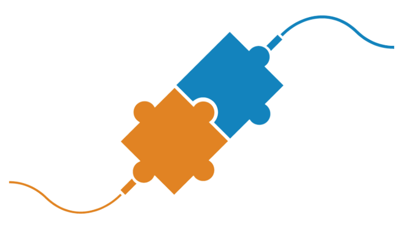

# GitLab Templates for JFrog

- [Overview](#Overview)
- [Installation](#Installation)
  - [Setting the JFrog Platform Connection Details](#Setting-the-JFrog-Platform-Connection-Details)
  - [Additional Optional Variables](#Additional-Optional-Variables)
  - [Limitations](#Limitations)
  - [Behind The Scenes](#Behind-The-Scenes)
- [Templates](#Templates)
  - [Build and Publish to JFrog Artifactory](#build-and-publish-to-jfrog-artifactory)
  - [Security Scan for Vulnerabilities](#security-scan-for-vulnerabilities)
- [Set Up a FREE JFrog Environment in the Cloud](#Set-Up-a-FREE-JFrog-Environment-in-the-Cloud)

# Overview
This repository hosts templates for GitLab CI, for quick and easy integration with the JFrog Platform.

The templates use the [.setup-jfrog.yml](https://github.com/jfrog/jfrog-cli/blob/v2/build/gitlab/.setup-jfrog.yml) script. The script is included by each of the templates, and sets up the integration between the pipeline and the JFrog Platform.

The script does the following:
* Installs [JFrog CLI](https://www.jfrog.com/confluence/display/CLI/JFrog+CLI)
* Configures JFrog CLI to work with the JFrog Platform
* Sets the build name and build number for JFrog CLI, with the values of `$CI_PROJECT_PATH_SLUG-$CI_COMMIT_REF_NAME` and `$CI_PIPELINE_ID` respectively
* Optionally replaces the default Docker Registry with an Artifactory Docker Registry    

## Installation
1. Ensure you have the connection details for the JFrog Platform. Don't have a JFrog Platform? [Set up a FREE instance in the cloud now](#Set-Up-a-FREE-JFrog-Environment-in-the-Cloud)   
2. [Set the JFrog Platform connection details](#Setting-the-JFrog-Platform-Connection-Details)
3. Optionally set the URL of your Artifactory Docker Registry as the value of the **JF_DOCKER_REGISTRY** variable
4. [Add the setup-jfrog script in your GitLab pipeline](#Adding-the-setup-jfrog-Script-in-Your-Pipeline)

### Setting the JFrog Platform Connection Details
Set the connection details to your JFrog Platform as [GitLab CI/CD variables](https://docs.gitlab.com/ee/ci/variables/) by using one of the following variables combinations:

1. JF_URL - Anonymous access (no authentication) 
2. JF_URL + JF_USER + JF_PASSWORD  - Basic authentication
3. JF_URL + JF_ACCESS_TOKEN  - Authentication with JFrog Access Token. NOTE: When using the container registry, a username is also required when using this option.

### Adding the setup-jfrog Script in Your Pipeline
The templates included in this repository already have the setup-jfrog script included as follows:

```yaml
include:
  - remote: 'https://releases.jfrog.io/artifactory/jfrog-cli/gitlab/.setup-jfrog.yml'
  # OR download it and include it from your project.
  - local: '.setup-jfrog.yml'
  # OR download it and include it from a common project.
  - project: 'my-group/my-project'
    file: '/script/.setup-jfrog.yml'
```

The script is then referenced from any `script` or `before_script` sections in the pipeline as follows:
```yaml
job:
  script:
    - !reference [.setup_jfrog, script]
    # OR for windows:
    - !reference [.setup_jfrog_windows, script]
```

### Additional Optional Variables
Configurations can be done via Project Settings > CI/CD > Variables:

| Variable                | Usage                                                                                                                                                                                                            |
|-------------------------|------------------------------------------------------------------------------------------------------------------------------------------------------------------------------------------------------------------|
| JF_DOCKER_REGISTRY      | Docker registry in Artifactory. For more info, see [Getting Started with Artifactory as a Docker Registry](https://www.jfrog.com/confluence/display/JFROG/Getting+Started+with+Artifactory+as+a+Docker+Registry) |
| JFROG_CLI_BUILD_PROJECT | JFrog project key to be used by commands which expect build name and build number. Determines the project of the published build.                                                                                |
| JFROG_CLI_VERSION       | Use a different CLI version than the one configured in the pipe. The minimal version is: 2.17.0                                                                                                                  |

List of other optional environment variables can be found in the CLI official [documentation](https://www.jfrog.com/confluence/display/CLI/CLI+for+JFrog+Artifactory#CLIforJFrogArtifactory-EnvironmentVariables).

### Limitations
1. If the `JF_DOCKER_REGISTRY` and `JF_ACCESS_TOKEN` variables are set, then the `JF_USER` variable is required.
2. Build info collection is unavailable when:
    * Working against the Docker Registry without JFrog CLI.
    * Running separate jobs on temporary agents or docker containers.

### Behind the Scenes
The actual setup scripts are maintained under the [jfrog-cli repository](https://github.com/jfrog/jfrog-cli/blob/v2/build/gitlab/.setup-jfrog.yml). 
It includes two hidden jobs with scripts, which can be referenced after the file is included.

## Templates
### Build and Publish to JFrog Artifactory
* [.NET](build-dotnet-core/.gitlab-ci.yml)
* [Go](build-go/.gitlab-ci.yml)
* [Gradle](build-gradle/.gitlab-ci.yml)
* [Maven](build-maven/.gitlab-ci.yml)
* [npm](build-npm/.gitlab-ci.yml)
* [NuGet](build-nuget/.gitlab-ci.yml)

### Security Scan for Vulnerabilities
* [.NET](audit-dotnet-core/.gitlab-ci.yml)
* [Go](audit-go/.gitlab-ci.yml)
* [Gradle](audit-gradle/.gitlab-ci.yml)
* [Maven](audit-maven/.gitlab-ci.yml)
* [npm](audit-npm/.gitlab-ci.yml)
* [NuGet](audit-nuget/.gitlab-ci.yml)

## Set Up a FREE JFrog Environment in the Cloud
Need a FREE JFrog environment in the cloud to use with these templates? Just run one of the following commands in your terminal. The commands will do the following:

1. Install JFrog CLI on your machine.
2. Create a FREE JFrog environment in the cloud for you.

**MacOS and Linux using cURL**
```
curl -fL "https://getcli.jfrog.io?setup" | sh
```

**Windows using PowerShell**
```
powershell "Start-Process -Wait -Verb RunAs powershell '-NoProfile iwr https://releases.jfrog.io/artifactory/jfrog-cli/v2-jf/[RELEASE]/jfrog-cli-windows-amd64/jf.exe -OutFile $env:SYSTEMROOT\system32\jf.exe'" ; jf setup
```